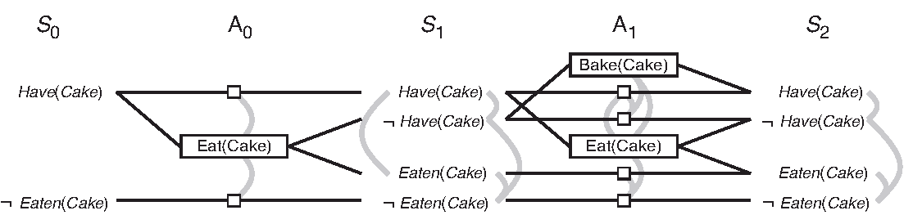

# Implement a Planning Search

## Synopsis

This project included skeletons for the classes and functions needed to solve deterministic logistics planning problems for an Air Cargo transport system using a planning search agent. 
With progression search algorithms, optimal plans for each 
problem were computed, using domain-independent heuristics.


This project can be separated into 2 parts.
- Part 1 - Planning problems:
	- Implement the Python methods and functions as marked in `my_air_cargo_problems.py`
	- Experiment and document metrics
- Part 2 - Domain-independent heuristics:
	- Implement relaxed problem heuristic in `my_air_cargo_problems.py`
	- Implement Planning Graph and automatic heuristic in `my_planning_graph.py`
	- Experiment and document metrics

### Written Analysis
- My written analysis can be found in analysis.md.
- The analysis consists of the following three key points.
- A summary of non-heuristic search result metrics (optimality, time elapsed, number of node expansions) for Problems 1,2, and 3. 
- A summary of heuristic search result metrics using A* with the "ignore preconditions" and "level-sum" heuristics for Problems 1, 2, and 3.
- An explanation for the best heuristic that I used, as well as my observations of it's effectiveness for all of the problems.

## Environment requirements
- Python 3.4 or higher
- Starter code includes a copy of [companion code](https://github.com/aimacode) from the Stuart Russel/Norvig AIMA text.  


## Project Details
### Part 1 - Planning problems

### My approach in planning was primarily derived from Stuart Russel and Perter Norvig's AIMA book.
"Artificial Intelligence: A Modern Approach" 3rd edition chapter 10 *or* 2nd edition Chapter 11 on Planning, available [on the AIMA book site](http://aima.cs.berkeley.edu/2nd-ed/newchap11.pdf) sections: 

- *The Planning Problem*
- *Planning with State-space Search*

#### GIVEN: classical PDDL problems

All problems are in the Air Cargo domain.  They have the same action schema defined, but different initial states and goals.

- Air Cargo Action Schema:
```
Action(Load(c, p, a),
	PRECOND: At(c, a) ∧ At(p, a) ∧ Cargo(c) ∧ Plane(p) ∧ Airport(a)
	EFFECT: ¬ At(c, a) ∧ In(c, p))
Action(Unload(c, p, a),
	PRECOND: In(c, p) ∧ At(p, a) ∧ Cargo(c) ∧ Plane(p) ∧ Airport(a)
	EFFECT: At(c, a) ∧ ¬ In(c, p))
Action(Fly(p, from, to),
	PRECOND: At(p, from) ∧ Plane(p) ∧ Airport(from) ∧ Airport(to)
	EFFECT: ¬ At(p, from) ∧ At(p, to))
```

- Problem 1 initial state and goal:
```
Init(At(C1, SFO) ∧ At(C2, JFK) 
	∧ At(P1, SFO) ∧ At(P2, JFK) 
	∧ Cargo(C1) ∧ Cargo(C2) 
	∧ Plane(P1) ∧ Plane(P2)
	∧ Airport(JFK) ∧ Airport(SFO))
Goal(At(C1, JFK) ∧ At(C2, SFO))
```
- Problem 2 initial state and goal:
```
Init(At(C1, SFO) ∧ At(C2, JFK) ∧ At(C3, ATL) 
	∧ At(P1, SFO) ∧ At(P2, JFK) ∧ At(P3, ATL) 
	∧ Cargo(C1) ∧ Cargo(C2) ∧ Cargo(C3)
	∧ Plane(P1) ∧ Plane(P2) ∧ Plane(P3)
	∧ Airport(JFK) ∧ Airport(SFO) ∧ Airport(ATL))
Goal(At(C1, JFK) ∧ At(C2, SFO) ∧ At(C3, SFO))
```
- Problem 3 initial state and goal:
```
Init(At(C1, SFO) ∧ At(C2, JFK) ∧ At(C3, ATL) ∧ At(C4, ORD) 
	∧ At(P1, SFO) ∧ At(P2, JFK) 
	∧ Cargo(C1) ∧ Cargo(C2) ∧ Cargo(C3) ∧ Cargo(C4)
	∧ Plane(P1) ∧ Plane(P2)
	∧ Airport(JFK) ∧ Airport(SFO) ∧ Airport(ATL) ∧ Airport(ORD))
Goal(At(C1, JFK) ∧ At(C3, JFK) ∧ At(C2, SFO) ∧ At(C4, SFO))
```

#### Methods and Functions to look for in `my_air_cargo_problems.py`
- `AirCargoProblem.get_actions` method including `load_actions` and `unload_actions` sub-functions
- `AirCargoProblem.actions` method
- `AirCargoProblem.result` method
- `air_cargo_p2` function
- `air_cargo_p3` function

#### Experiment and document metrics for non-heuristic planning solution searches
* Run uninformed planning searches for `air_cargo_p1`, `air_cargo_p2`, and `air_cargo_p3`; take note of metrics on number of node expansions required, number of goal tests, time elapsed, and optimality of solution for each search algorithm. 
* Use the `run_search` script for your data collection: from the command line type `python run_search.py -h` to learn more.

>#### Why are we setting the problems up this way?  
>Progression planning problems can be 
solved with graph searches such as breadth-first, depth-first, and A*, where the 
nodes of the graph are "states" and edges are "actions".  A "state" is the logical 
conjunction of all boolean ground "fluents", or state variables, that are possible 
for the problem using Propositional Logic. For example, we might have a problem to 
plan the transport of one cargo, C1, on a
single available plane, P1, from one airport to another, SFO to JFK.

In this simple example, there are five fluents, or state variables, which means our state 
space could be as large as . Note the following:
>- While the initial state defines every fluent explicitly, in this case mapped to **TTFFF**, the goal may 
be a set of states.  Any state that is `True` for the fluent `At(C1,JFK)` meets the goal.
>- Even though PDDL uses variable to describe actions as "action schema", these problems
are not solved with First Order Logic.  They are solved with Propositional logic and must
therefore be defined with concrete (non-variable) actions
and literal (non-variable) fluents in state descriptions.
>- The fluents here are mapped to a simple string representing the boolean value of each fluent
in the system, e.g. **TTFFTT...TTF**.  This will be the state representation in 
the `AirCargoProblem` class and is compatible with the `Node` and `Problem` 
classes, and the search methods in the AIMA library.  


### Part 2 - Domain-independent heuristics
### Readings relevant to Part 2: 
"Artificial Intelligence: A Modern Approach" 3rd edition chapter 10 *or* 2nd edition Chapter 11 on Planning, available [on the AIMA book site](http://aima.cs.berkeley.edu/2nd-ed/newchap11.pdf) section: 

- *Planning Graph*

#### Heuristic method was implemented in `my_air_cargo_problems.py`
- `AirCargoProblem.h_ignore_preconditions` method

#### Planning Graph with automatic heuristics was implemented in the following methods from `my_planning_graph.py`:
- `PlanningGraph.add_action_level` method
- `PlanningGraph.add_literal_level` method
- `PlanningGraph.inconsistent_effects_mutex` method
- `PlanningGraph.interference_mutex` method
- `PlanningGraph.competing_needs_mutex` method
- `PlanningGraph.negation_mutex` method
- `PlanningGraph.inconsistent_support_mutex` method
- `PlanningGraph.h_levelsum` method


#### Experiment and document: metrics of A* searches with these heuristics
* Run A* planning searches using the heuristics you have implemented on `air_cargo_p1`, `air_cargo_p2` and `air_cargo_p3`. Take note of metrics on number of node expansions required, number of goal tests, time elapsed, and optimality of solution for each search algorithm. 
* Use the `run_search` script for this purpose: from the command line type `python run_search.py -h` to learn more.

>#### Why a Planning Graph?
>The planning graph is somewhat complex, but is useful in planning because it is a polynomial-size approximation of the exponential tree that represents all possible paths. The planning graph can be used to provide automated admissible heuristics for any domain.  It can also be used as the first step in implementing GRAPHPLAN, a direct planning algorithm that you may wish to learn more about on your own (but we will not address it here).

>*Planning Graph example from the AIMA book*
>


## Examples and Testing:
- As a way to help initialize some starter code, Udacity has provided some examples and tests with the files below, originating from [this](https://github.com/udacity/AIND-Planning) repository.
- The planning problem for the "Have Cake and Eat it Too" problem in AIMA has been
implemented in the `example_have_cake` module as an example.
- The `tests` directory includes `unittest` test cases to evaluate your implementations. All tests should pass before you submit your project for review. From the AIND-Planning directory command line:
    - `python -m unittest tests.test_my_air_cargo_problems`
    - `python -m unittest tests.test_my_planning_graph`
- The `run_search` script is provided for gathering metrics for various search methods on any or all of the problems and should be used for this purpose.


## A note on long execution times
The exercises in this project can take a *long* time to run (from several seconds to a several hours) depending on the heuristics and search algorithms utilised. If you are attempting to reproduce my results, I recommend installing and using [pypy3](http://pypy.org/download.html) -- a python JIT, which can accelerate execution time substantially.  Using pypy is *not* required to achieve the same results as me, but could prove useful in discovering the intuition behind some of the more sophisticated problems in the project.
